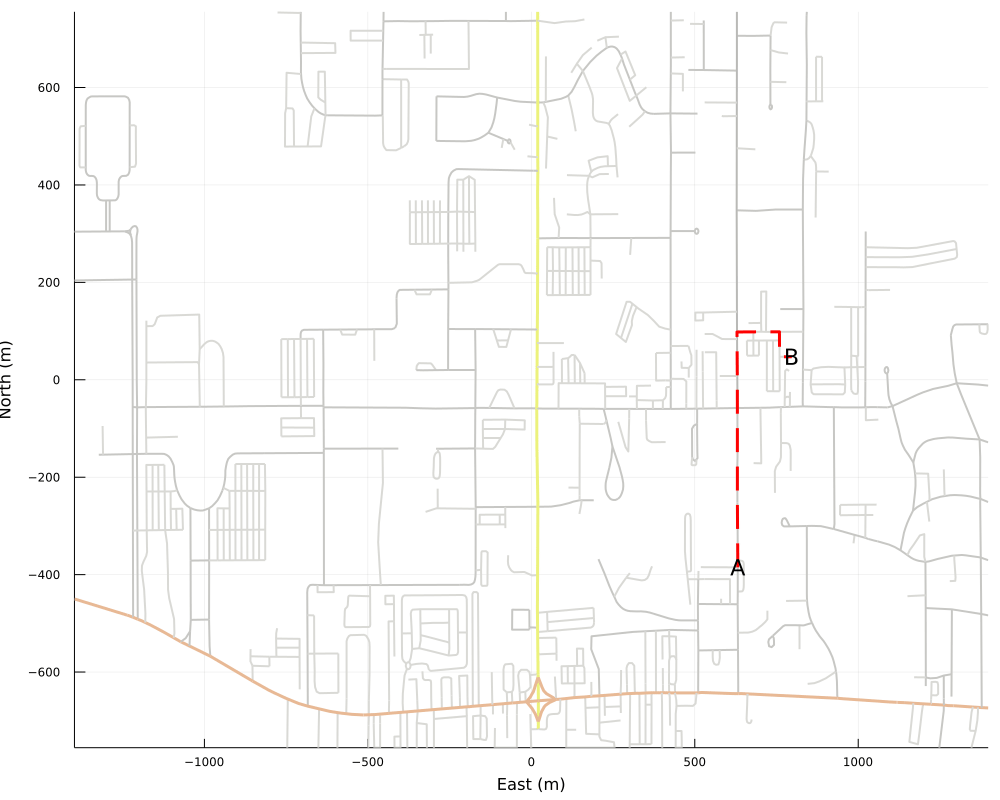

# NiuMap

Personal project that visualized shortest paths on the NIU compass. Program creates a gif with an agent traversing the path.

## Package Installation
```julia
using Pkg; Pkg.add("OpenStreetMapXPlot", "OpenStreetMapX", "Plots", "LightGraphs", "Agents")
```

## Gif Created
